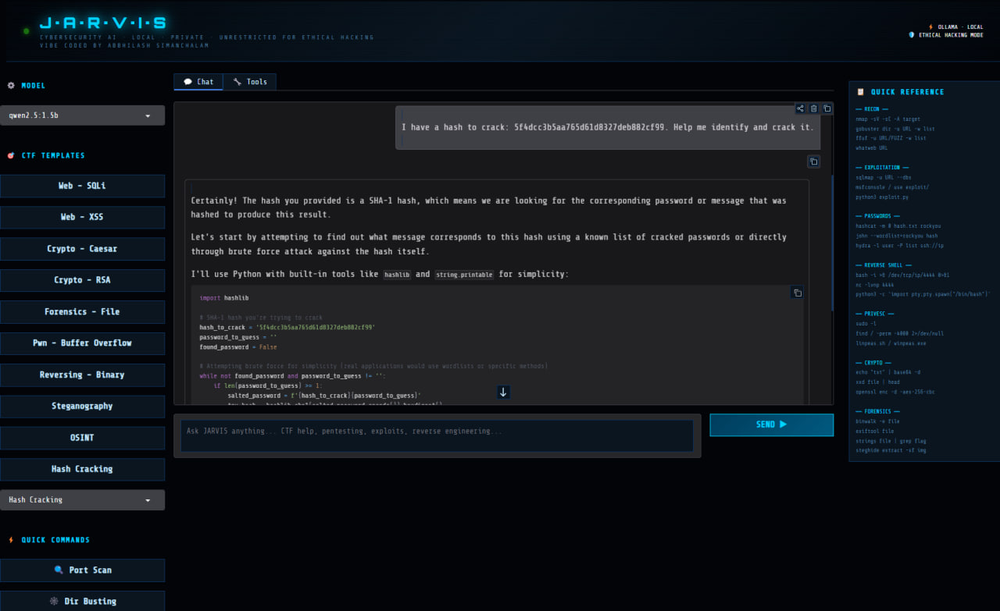
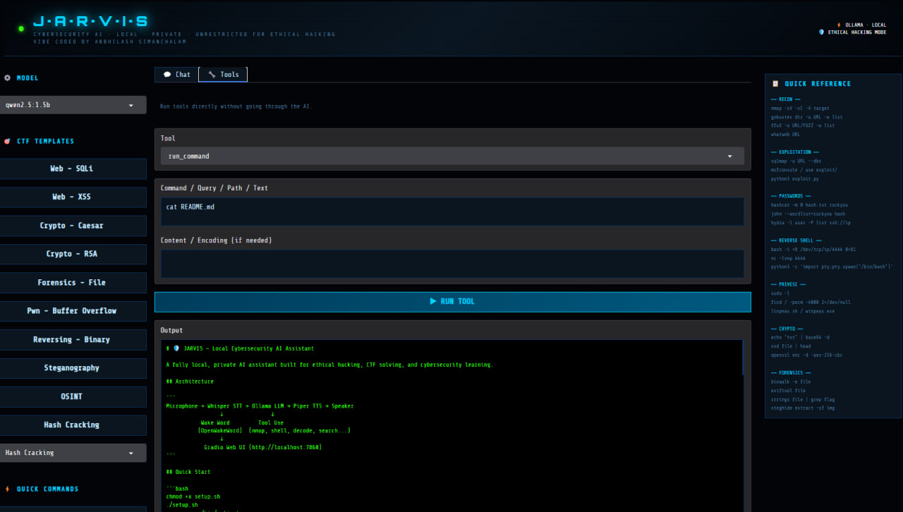
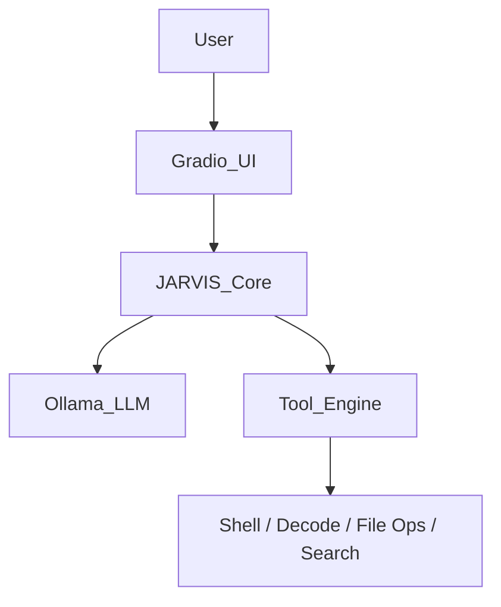

# 🛡️ J.A.R.V.I.S - *Local Cybersecurity AI Assistant*

<p align="center">
  
</p>

A fully **local, private cybersecurity AI assistant** built for:

- 🎯 CTF Solving (HTB, TryHackMe, etc.)
- 🔍 Ethical Hacking & Pentesting Practice
- 🧠 Cybersecurity Learning & Research

⚡ Powered by **Ollama (Local LLM)** + **Gradio UI** + **Tool Execution Engine**

---

## 🖥️ Screenshots

### 💬 Chat Interface


---

### 🔧 Tool Execution Panel


---

## 📥 Clone This Repository

```bash
git clone https://github.com/abby-exe/Jarvis_CyberSecurity_AI.git
cd Jarvis_CyberSecurity_AI
```

## 🚀 Quick Setup (Recommended)

```bash
chmod +x setup.sh  //Set execution permission for one-file installer
./setup.sh
python3 -m venv .venv  //Create python virtual environment         
source venv/bin/activate 
python jarvis_ui.py //Run the Web UI
```

### Open:

`http://localhost:7860`

## 🛠️ Manual Installation for Models (Step-by-Step)

### 1. Install Ollama

```bash
curl -fsSL https://ollama.com/install.sh | sh
ollama serve
```

### 2. Install Models

| Tier | Model Command | Pros/Cons | Best For |
| :--- | :--- | :--- | :--- |
| **⚡ Lightweight** | `ollama pull mistral`<br>`ollama pull llama3.2` | ✔ Fast / Low RAM<br>❌ Less accurate | Low-end laptops / CPU only |
| **⚖️ Balanced** | `ollama pull qwen2.5:1.5b` | ✔ Speed + Accuracy | **Recommended** for CTF & Pentesting |
| **🧠 Advanced** | `ollama pull deepseek-r1` | ✔ Expert Reasoning<br>❌ Slower on CPU | Complex challenges & Exploit logic |
| **🚀 High-End** | `ollama pull nu11secur1tyAI` | ✔ Red Team focused<br>⚠️ Needs 16GB+ RAM | Exploit dev & Attack simulation |

### 🔄 Switching Models

Inside UI → dropdown
OR:

```bash
export OLLAMA_MODEL=mistral
python jarvis_ui.py
```

## ⚙️ Features

* 💬 **Chat-based** cybersecurity assistant
* 🎯 **Prebuilt CTF templates** (SQLi, XSS, Crypto, Pwn, etc.)
* ⚡ **Quick commands** panel
* 📋 Built-in **hacking cheatsheet**
* 🔄 **Live model switching**
* 🔒 **Fully local** (no API, no cloud)

---

## 🧠 Built-in Tool Engine

JARVIS includes a tool execution system to interact with your environment:

| Tool | Description |
| :--- | :--- |
| `run_command` | Execute shell commands (nmap, sqlmap, etc.) |
| `web_search` | Search CVEs / writeups |
| `read_file` | Read local files |
| `write_file` | Save payloads/scripts |
| `decode` | Base64, hex, rot13, URL, etc. |

### ⚡ Command Execution (IMPORTANT)
JARVIS can execute terminal commands using Python to automate workflows:
* **Runs tools like:** `nmap`, `gobuster`, `sqlmap`, and custom scripts.
* ✔ Highly useful for CTF automation.
* ⚠️ Some dangerous commands are blocked.
* ⚠️ **Still use responsibly.**

---

## 🧩 Architecture



## 🧪 Use Cases

* 🎯 **HTB / TryHackMe** challenges
* 🔍 **Recon** automation
* 💉 **Web exploitation** testing
* 🔐 **Password cracking** workflows
* 📦 **Exploit development**
* 🧠 **Learning** cybersecurity concepts

---

## ⚖️ Legal Disclaimer

This tool is strictly for:

* ✅ **Learning**
* ✅ **CTF challenges**
* ✅ **Authorized penetration testing**

❌ **Do NOT use against systems without permission.**

---

## 👨‍💻 Author

Built by **Abby (Abbhilash Simanchalam)** *Cybersecurity Enthusiast* ⚡

---

## 📄 License

Distributed under the **MIT License**. See `LICENSE` for more information.

---

## ⭐ Support

If you like this project:

* ⭐ **Star** the repo
* 🚀 **Share** with others
